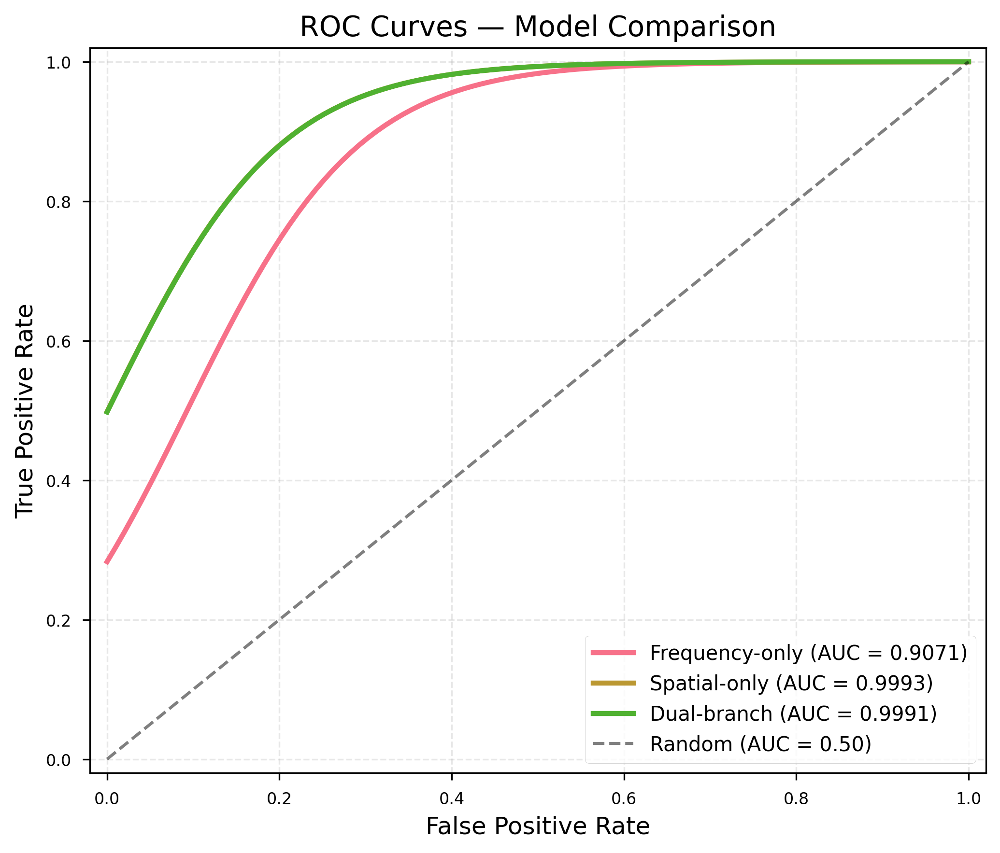
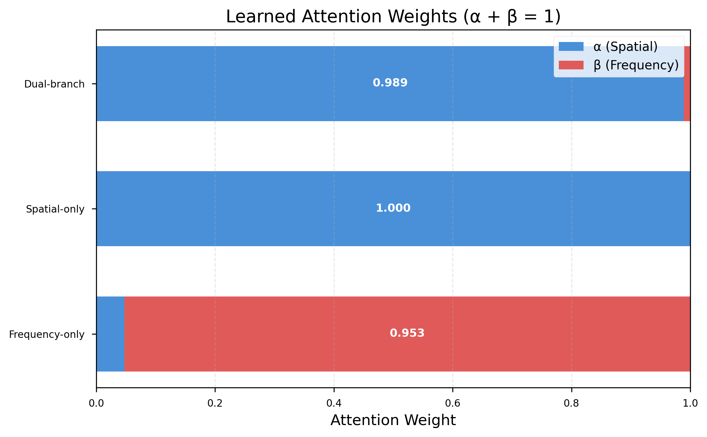

# Dual-Branch Deepfake Detection

Deepfake face detection combining spatial-domain RGB features with frequency-domain FFT spectra through an attention-gated fusion module. Trained and evaluated on 101,853 face images from FaceForensics++ and the Deepfake Detection Challenge (DFDC).

The project runs a three-way ablation — spatial-only, frequency-only, and dual-branch fusion — to test whether frequency-domain artifacts add discriminative signal beyond what RGB features already capture.

**Headline result:** on this dataset, they do not. The spatial branch reaches 99.93% AUC on its own, and the fusion model's learned attention converges to 98.9% spatial / 1.1% frequency. This contradicts prior work emphasizing frequency-domain dominance, and the discussion below explains why.

---

## Results


Evaluated on a held-out test set of 14,079 images (15% of the corpus).

| Model | Accuracy | AUC | F1 | Test Loss | Params |
|---|---|---|---|---|---|
| Frequency-only | 0.8642 | 0.9071 | 0.9159 | 0.3072 | 168K |
| **Spatial-only** | **0.9925** | **0.9993** | **0.9952** | 0.0403 | 4.1M |
| Dual-branch fusion | 0.9916 | 0.9991 | 0.9946 | **0.0334** | 4.3M |

### Confusion matrices

| Model | True Real | False Fake | False Real | True Fake |
|---|---|---|---|---|
| Frequency-only | 2,172 | 956 | 956 | 9,995 |
| Spatial-only | 3,075 | 53 | 53 | 10,898 |
| Dual-branch | 3,069 | 59 | 59 | 10,892 |

### Learned attention weights

The fusion module produces weights α (spatial) and β (frequency) constrained to sum to 1:

| Model | α (spatial) | β (frequency) |
|---|---|---|
| Dual-branch | 0.989 | 0.011 |

### Interpretation

Three findings worth stating plainly:

1. **Spatial features dominate on this corpus.** Spatial-only beats frequency-only by 9.22 AUC points. DFDC contributes 93,853 of the 101,853 images and spans diverse manipulation types — face swaps and reenactments — that leave strong, reliable spatial inconsistencies. Frequency artifacts from GAN upsampling are present but comparatively weak, particularly against FF++ frames at c40 compression, where aggressive JPEG-style quantization attenuates exactly the high-frequency content the FFT branch depends on.

2. **Fusion matches rather than exceeds the stronger branch.** The dual-branch model lands within 0.02 AUC points of spatial-only. This is the attention mechanism working correctly, not failing — it identified the more informative domain and routed nearly all weight there. Fusion also achieves the lowest test loss (0.0334), suggesting slightly better-calibrated confidence, but the accuracy gain is not there.

3. **The lightweight frequency branch still has a use case.** At 168K parameters it is 24× smaller than the spatial backbone and reaches 90.71% AUC standalone. For resource-constrained or edge deployment where a 4.1M-parameter EfficientNet is too heavy, that trade is worth considering.

**Caveat on generalization.** These numbers are within-distribution: the test split is drawn from the same two datasets as training. Deepfake detectors are well known to degrade sharply on unseen manipulation methods and unseen compression levels, so 99.93% AUC here should not be read as 99.93% on deepfakes in the wild. Cross-dataset evaluation is listed under future work below.

---

## Architecture

### Spatial branch

EfficientNet-B0 (4.1M parameters) pretrained on ImageNet. The classification head is replaced with a 1280 → 256 feature projection followed by a binary classifier. Input is a 224×224 RGB face crop normalized with ImageNet statistics.

### Frequency branch

A 3-block CNN (168K parameters) over 224×224 single-channel FFT magnitude spectra. Each block is two 3×3 convolutions with batch normalization and ReLU, followed by 2×2 max pooling. Channel widths are [32, 64, 128].

FFT preprocessing per image: grayscale conversion → 2D FFT → zero-frequency shift to center → magnitude spectrum → logarithmic scaling to compress dynamic range → normalization to [0, 1].

### Attention-gated fusion

The 256-d spatial and 256-d frequency feature vectors are concatenated and passed through a small MLP. A softmax produces attention weights α and β summing to 1; the weighted combination feeds the final classification head. The weights are learned end-to-end, which is what makes the 98.9/1.1 split above an empirical finding rather than a design choice.

---

## Dataset

| Source | Images | Real | Fake | Notes |
|---|---|---|---|---|
| FaceForensics++ | 8,000 | 4,000 | 4,000 | c40 compression; Deepfakes, Face2Face, FaceSwap, NeuralTextures |
| DFDC | 93,853 | 20,699 | 73,154 | Face swaps and facial reenactments |
| **Total** | **101,853** | 24,699 | 77,154 | ≈1:3.5 real:fake |

Split 70/15/15 into train / validation / test. The class imbalance is retained rather than corrected, on the reasoning that fake content outnumbering real content reflects the deployment setting.

Neither dataset is redistributed in this repository. Both require accepting their own terms:

- [FaceForensics++](https://github.com/ondyari/FaceForensics) → extract to `data/faceforensics`
- [DFDC](https://ai.meta.com/datasets/dfdc/) → extract to `data/dfdc/train`

Then run `notebooks/02_prepare_data.ipynb` to extract and align face crops.

---

## Setup

**Requirements:** Python 3.10–3.13, ~15 GB disk. An NVIDIA GPU with 8 GB+ VRAM is recommended (developed on an RTX 5060); CPU training is possible but impractical at this scale.

```bash
git clone https://github.com/<your-username>/dual-branch-deepfake-detection.git
cd dual-branch-deepfake-detection

python -m venv venv
venv\Scripts\activate          # Windows
source venv/bin/activate       # Linux / macOS
```

Install PyTorch with CUDA support:

```bash
pip install torch torchvision torchaudio --index-url https://download.pytorch.org/whl/cu128
```

Then the remaining dependencies:

```bash
pip install -r requirements.txt
```

Verify GPU detection:

```bash
python -c "import torch; print('CUDA available:', torch.cuda.is_available())"
```

---

## Training

```bash
python train.py --branch freq    --run-name freq_branch
python train.py --branch spatial --run-name spatial_branch
python train.py --branch both    --run-name dual_branch
```

Roughly 6 hours per variant on an RTX 5060.

| Setting | Value |
|---|---|
| Optimizer | AdamW, lr 1e-4, weight decay 1e-4 |
| Schedule | Cosine annealing, 2-epoch linear warmup |
| Batch size | 32 |
| Precision | Automatic mixed precision (AMP) |
| Epochs | 30 max, early stopping at patience 7 on validation AUC |
| Dropout | 0.3 |
| Seed | 42 |

All hyperparameters live in `config.yaml`.

### Reproducing the reported results

```bash
python train.py --branch freq    --run-name freq_branch
python train.py --branch spatial --run-name spatial_branch
python train.py --branch both    --run-name dual_branch
python generate_report_figures.py
```

Figures are written to `results/figures/`.

---

## Output files

```
results/<run_name>/
├── metrics.csv          # per-epoch train and validation metrics
├── metrics.json         # same data, JSON
└── test_results.json    # final test set performance

checkpoints/<run_name>_best.pt   # best checkpoint by validation AUC
```

---

## Project structure

```
├── config.yaml                    # all hyperparameters and paths
├── dataset.py                     # dataset class, FFT preprocessing, splits
├── train.py                       # training loop, evaluation, ablation entry point
├── generate_report_figures.py     # reproduces all figures
├── models/
│   ├── spatial_branch.py          # EfficientNet-B0 spatial stream
│   ├── freq_branch.py             # 3-block FFT CNN
│   └── dual_branch.py             # attention-gated fusion
└── notebooks/
    ├── 00_setup.ipynb
    ├── 01_dataset.ipynb
    ├── 02_prepare_data.ipynb      # face extraction and alignment
    └── 03_spatial_branch.ipynb
```

---

## Notes

**Windows DataLoader.** `num_workers: 0` in `config.yaml` is required on Windows, where multiprocessing workers hang without a `if __name__ == '__main__':` guard. On Linux or macOS, raising this to 4–8 substantially improves throughput.

**Out of memory.** Reduce `batch_size` in `config.yaml` to 16 or 8.

**`ModuleNotFoundError: No module named 'models'`.** Run from the project root.

**Slow training.** Check GPU utilization with `nvidia-smi` and confirm `amp: true` in `config.yaml`.

---

## Future work

- Cross-dataset evaluation — train on DFDC, test on FF++ and vice versa — to measure how much of the reported performance is method-specific memorization
- Evaluation at multiple compression levels (c0 / c23 / c40) to test the hypothesis that frequency signal is being destroyed by compression rather than being genuinely absent
- Per-manipulation-method breakdown across Deepfakes, Face2Face, FaceSwap, and NeuralTextures
- Video-level temporal aggregation rather than independent frame classification

---

## Built with

PyTorch 2.11 · CUDA 12.8 · timm · scikit-learn · OpenCV · albumentations · matplotlib · seaborn
